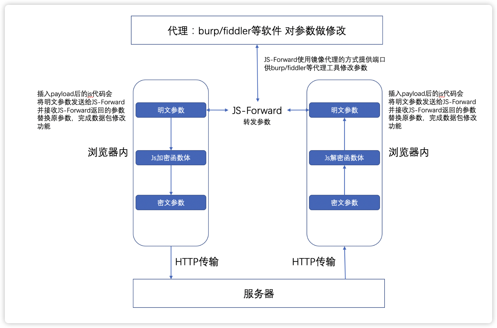
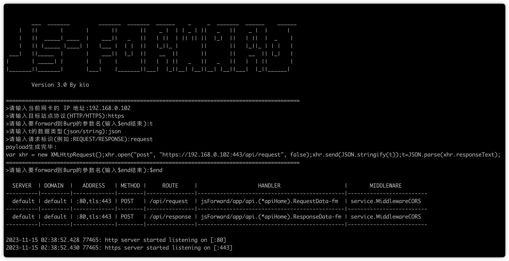
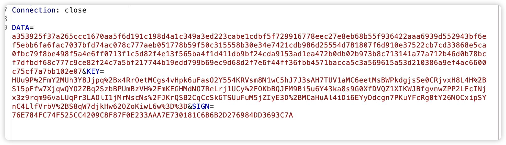
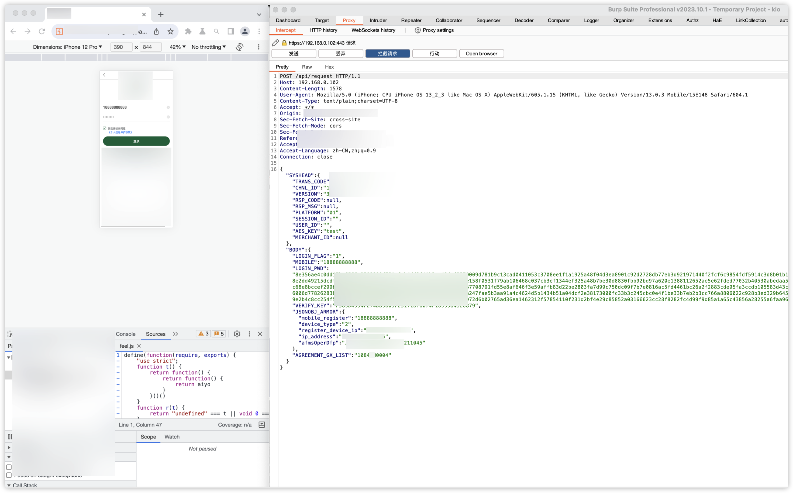
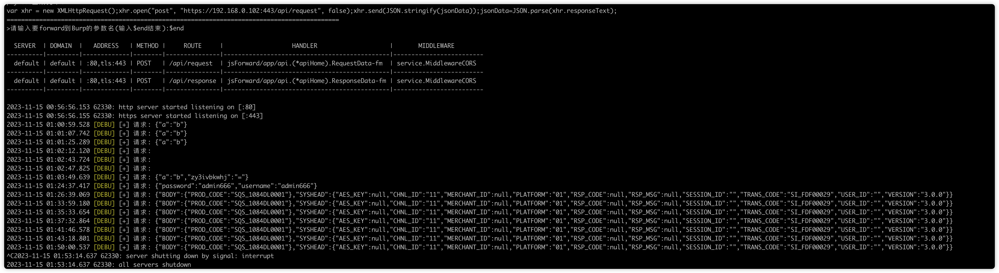
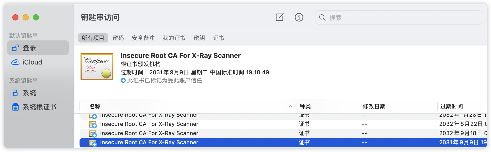

# 前言

站在大佬的肩膀上继续前行。

由于一些原因，现在大部分金融站点、APP都进行了加密，正好忙里偷闲改个轮子，方便大家使用。

在此感谢两位大佬

https://github.com/anfutest

[https://github.com/G-Security-Team](https://github.com/G-Security-Team/JS-Forward)

本项目是基于两位大佬的进行二开，具体原理请移步

https://github.com/G-Security-Team/JS-Forward/

# 正文

原理图：

使用介绍：

将生成的payload直接插入到要篡改的变量前。

解密前：

解密后：

可实现对加密包的全自动化加解密，更方便各位师傅转发到X-RAY、sqlmap等工具上。

传输过程：

注：https站点需要信任证书

